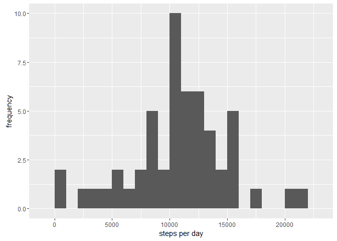
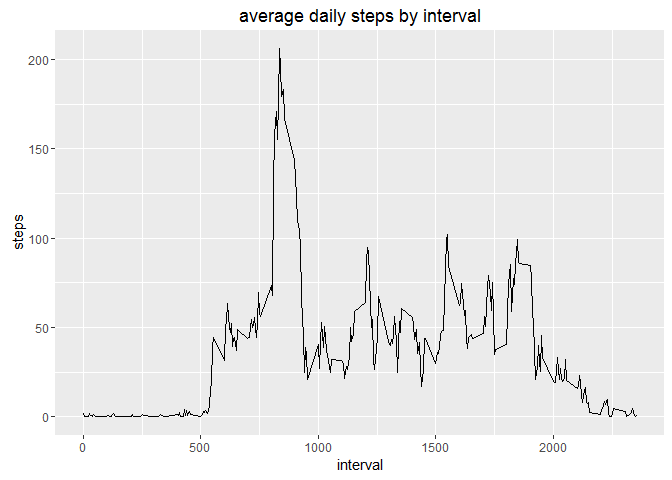
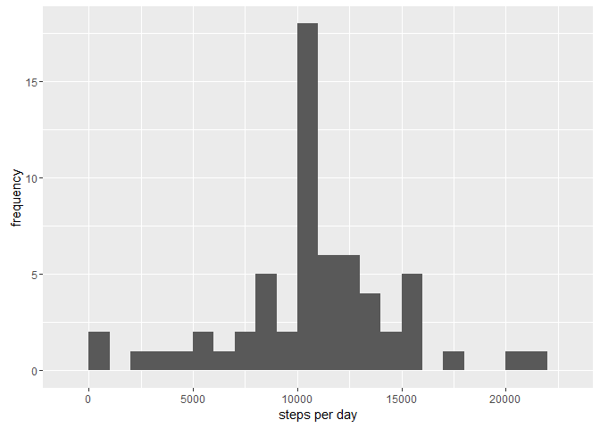

# Reproducible Research: Peer Assessment 1
grahams@pipeline.com  


```r
library(ggplot2)
library(lubridate)
```

## Loading and preprocessing the data

I read the csv without saving the unzipped file.

```r
df <- read.csv(unz("activity.zip", "activity.csv"))


df$dt <- ymd(df$date)
```

```
## Warning in as.POSIXlt.POSIXct(x, tz): unable to identify current timezone 'C':
## please set environment variable 'TZ'
```

```
## Warning in as.POSIXlt.POSIXct(x, tz): unknown timezone 'localtime'
```

```r
head(df)
```

```
##   steps       date interval         dt
## 1    NA 2012-10-01        0 2012-10-01
## 2    NA 2012-10-01        5 2012-10-01
## 3    NA 2012-10-01       10 2012-10-01
## 4    NA 2012-10-01       15 2012-10-01
## 5    NA 2012-10-01       20 2012-10-01
## 6    NA 2012-10-01       25 2012-10-01
```


## What is mean total number of steps taken per day?


```r
ms <- r <- aggregate(steps~dt, data=df, sum, na.rm=TRUE)
```
histogram (not a graph of steps against days, but of num days per (binned) num steps)


```r
qplot(ms$steps, xlab='steps per day', ylab='frequency',  binwidth=100)
```

 

mean steps per day = ``10,766``
median steps per day = ``10,765``

## What is the average daily activity pattern?
Here we look at the activity per 5 minute interval (these are numbered from 1 to 2355 per day) averaged over each day


```r
acs <- aggregate(steps~interval, data=df, mean, na.rm=TRUE)  


ggplot(acs, aes(interval, steps)) + geom_line() + ggtitle('average daily steps by interval') 
```

 

Which 5-minute interval, on average across all the days in the dataset, contains the maximum number of steps?


```r
acs[which (acs$steps == max(acs$steps)),'interval']
```

```
## [1] 835
```

## Imputing missing values

number of missing measurements:


```r
colSums(is.na(df))
```

```
##    steps     date interval       dt 
##     2304        0        0        0
```

there are ``2304`` missing step measurements. All other entries are complete.


There are two obvious strategies to fill in missing values. 

1. Use the average for that day
2. Use the average for that interval

More elaborate strategies would look for trends/patterns etc.

We use option 2. (Some days have no measurements at all, weighting would be tricky)


```r
df2 <- data.frame(df)
df2$steps <- ifelse(is.na(df$steps), round(acs[which(acs$interval==df$interval),'steps']), df$steps)
```
now draw the new histogram


```r
ms2 <- r <- aggregate(steps~dt, data=df2, sum)


qplot(ms2$steps, xlab='steps per day', ylab='frequency',  binwidth=100)
```

 

mean steps per day = ``10,766``
median steps per day = ``10,763``

I don't see any difference here, which makes me think I've made a mistake.

## Are there differences in activity patterns between weekdays and weekends?


```r
df2$IsWeekend <- ifelse(weekdays(df2$dt) %in% c('Saturday', 'Sunday'), 'Weekend', 'Not Weekend')


acs2 <- aggregate(steps~interval+IsWeekend, data=df2, mean)
ggplot(acs2, aes(interval, steps)) + geom_line() + ggtitle('average daily steps by interval') + facet_grid(IsWeekend~.)
```

 
